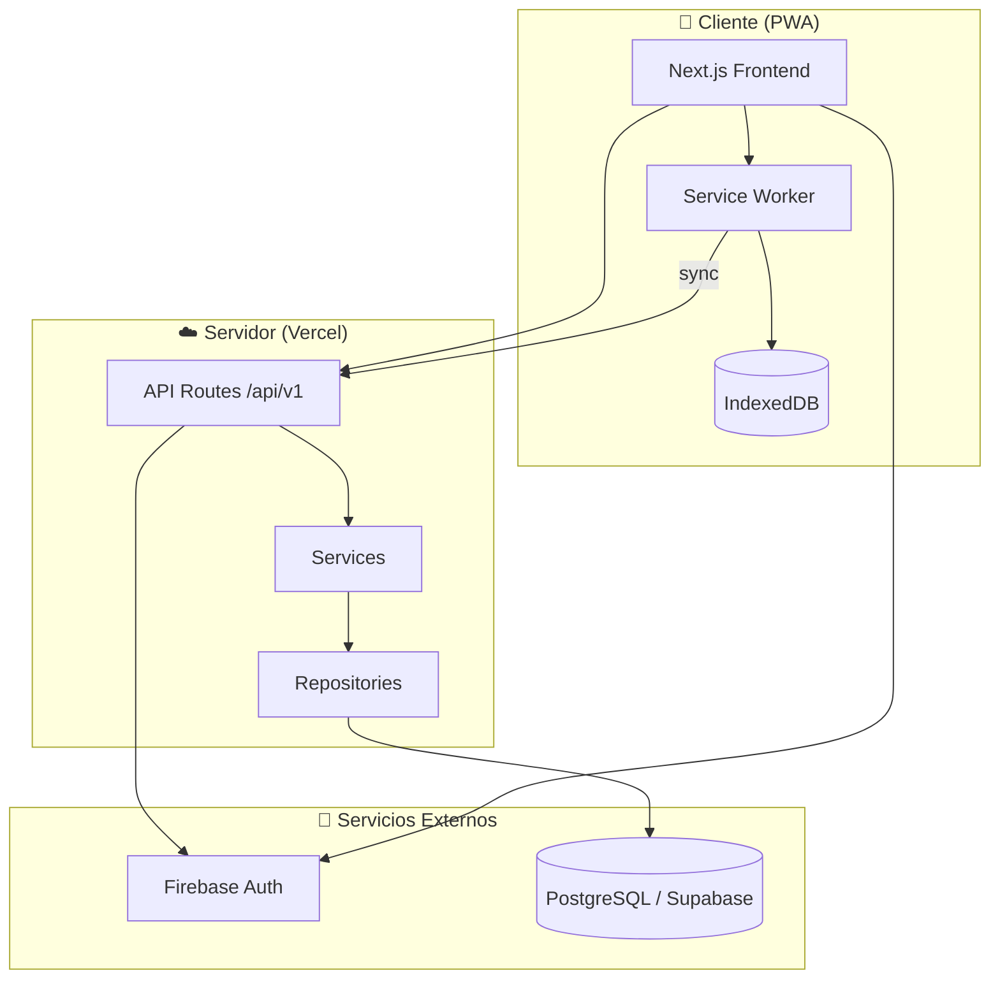

<div align="center">

# ⏱️ Partes — Sistema de Registro de Jornales

**Plataforma SaaS multi-tenant para el registro, control y análisis de horas trabajadas por empleados jornaleros.**

[](https://github.com/sr-lechuga/partes/releases)
[]()
[](LICENSE)

[](https://nextjs.org/)
[](https://www.typescriptlang.org/)
[](https://www.prisma.io/)
[](https://supabase.com/)
[](https://firebase.google.com/)
[](https://vercel.com/)

</div>

---

## 📖 Descripción

**Partes** es un sistema SaaS B2B diseñado para empresas que trabajan con empleados jornaleros (informales o semi-formales). Permite registrar horas trabajadas de forma simple, calcular automáticamente horas extra, mantener un historial de auditoría completo y generar reportes analíticos para la toma de decisiones.

### ¿Qué problema resuelve?

Muchas empresas en Uruguay (y la región) gestionan las horas de sus trabajadores jornaleros con planillas de papel, WhatsApp o métodos informales. Esto genera:

- ❌ **Errores** en el cálculo de horas y pagos
- ❌ **Falta de trazabilidad** en las correcciones
- ❌ **Pérdida de datos** por mal manejo de registros
- ❌ **Dificultad** para generar reportes de costos

**Partes** soluciona esto con una app simple, mobile-first y con soporte offline, pensada para usuarios no técnicos.

---

## ✨ Características Principales

<table>
<tr>
<td width="50%">

### 📱 Registro de Jornadas
- Inicio/fin con timer (1 toque)
- Carga manual (hasta 48h de atraso)
- Funcionamiento offline (PWA)
- Sincronización automática

</td>
<td width="50%">

### 📊 Analytics y Reportes
- Horas por empleado y período
- Ranking por horas y costos
- Agrupación diaria/semanal/mensual
- Exportación a Excel

</td>
</tr>
<tr>
<td width="50%">

### 🔒 Auditoría Completa
- Historial inmutable de cambios
- Registro de quién, cuándo y por qué
- Trazabilidad total de ediciones

</td>
<td width="50%">

### 🏢 Multi-Tenant
- Aislamiento total por empresa
- Roles: Empleado, RRHH, Admin
- Un usuario puede pertenecer a varias empresas

</td>
</tr>
</table>

---

## 🛠️ Stack Tecnológico

| Capa | Tecnología | Propósito |
|------|-----------|----------|
| **Frontend** | Next.js (App Router) | UI responsive, PWA, SSR/SSG |
| **Backend** | Next.js API Routes | API REST `/api/v1` |
| **Lenguaje** | TypeScript | Tipado estricto en todo el proyecto |
| **Base de datos** | PostgreSQL (Supabase) | Datos persistentes, relaciones |
| **ORM** | Prisma | Migraciones, queries type-safe |
| **Autenticación** | Firebase Auth | Login con Google y teléfono (SMS) |
| **Validación** | Zod | Schemas de validación |
| **Exportación** | ExcelJS | Generación de reportes .xlsx |
| **Offline** | IndexedDB (idb) | Cola de operaciones offline |
| **Hosting** | Vercel + Supabase | Deploy automático, edge network |

---

## 🚀 Inicio Rápido

### Requisitos previos

- [Node.js](https://nodejs.org/) 18.x o superior
- [npm](https://www.npmjs.com/) 9.x o superior
- Cuenta en [Supabase](https://supabase.com/) (base de datos)
- Proyecto en [Firebase](https://firebase.google.com/) (autenticación)

### Instalación

```bash
# 1. Clonar el repositorio
git clone https://github.com/sr-lechuga/partes.git
cd partes

# 2. Instalar dependencias
npm install

# 3. Configurar variables de entorno
copy .env.example .env.local
# → Editar .env.local con tus credenciales

# 4. Configurar base de datos
npx prisma generate
npx prisma migrate dev

# 5. Iniciar servidor de desarrollo
npm run dev
```

La aplicación estará disponible en `http://localhost:3000`

### Scripts disponibles

```bash
npm run dev          # Servidor de desarrollo
npm run build        # Build de producción
npm run start        # Iniciar producción
npm run lint         # Ejecutar linter
npm run test         # Ejecutar tests
npm run db:studio    # Abrir Prisma Studio (GUI de BD)
npm run db:migrate   # Ejecutar migraciones
npm run db:seed      # Cargar datos de prueba
```

---

## 📁 Estructura del Proyecto

```
partes/
├── prisma/                     # Schema y migraciones de BD
├── src/
│   ├── app/                    # App Router de Next.js
│   │   ├── api/v1/             # API REST endpoints
│   │   └── (dashboard)/        # Páginas de la app
│   ├── components/             # Componentes React
│   ├── services/               # Lógica de negocio
│   ├── repositories/           # Acceso a datos
│   ├── domain/                 # Tipos y entidades
│   ├── lib/                    # Utilidades y config
│   └── middleware.ts           # Auth y tenant middleware
├── tests/                      # Tests unitarios, integración, E2E
├── docs/                       # Documentación detallada
│   ├── requirements/           # Requerimientos por versión
│   └── summary.md              # Resumen ejecutivo
├── REGLAS_REPOSITORIO.md       # Convenciones del proyecto
├── DEPENDENCIES.md             # Registro de dependencias
├── DEBUGGING_SETUP.md          # Guía de debugging
└── README.md                   # Este archivo
```

---

## 🗺️ Roadmap

### MVP (v0.1) — En desarrollo 🟡

- [ ] Autenticación (Google + teléfono)
- [ ] Gestión de empresas y usuarios
- [ ] Alta/baja de empleados
- [ ] Registro de jornadas (timer + manual)
- [ ] Cálculo automático de horas extra
- [ ] Auditoría inmutable
- [ ] Analytics básicos (horas, costos, rankings)
- [ ] Exportación a Excel
- [ ] Soporte offline (PWA)

### V1 (v1.0) — Planificado 📋

- [ ] Dashboard visual con KPIs y gráficos
- [ ] Flujo de aprobación/rechazo de jornadas
- [ ] Exportación a PDF
- [ ] Notificaciones (jornada incompleta, sync pendiente)
- [ ] Búsqueda avanzada
- [ ] Modo oscuro

### V2 (v2.0) — Futuro 🔮

- [ ] Liquidación automática de haberes
- [ ] Integración con sistemas contables
- [ ] Integración WhatsApp
- [ ] Roles avanzados (Supervisor, Auditor)
- [ ] Soporte multi-moneda
- [ ] Internacionalización (español + portugués)

> 📄 Ver documentación detallada de cada versión en [`docs/requirements/`](docs/requirements/)

---

## 🏗️ Arquitectura



---

## 🔐 Roles y Permisos

| Acción | Empleado | RRHH | Admin |
|--------|:--------:|:----:|:-----:|
| Iniciar/cerrar jornada | ✅ | ✅ | ✅ |
| Ver jornadas propias | ✅ | ✅ | ✅ |
| Ver jornadas de otros | ❌ | ✅ | ✅ |
| Editar jornadas | ❌ | ✅ | ✅ |
| Aprobar/rechazar jornadas | ❌ | ✅ | ✅ |
| Ver analytics | ❌ | ✅ | ✅ |
| Exportar reportes | ❌ | ✅ | ✅ |
| Gestionar empleados | ❌ | ✅ | ✅ |
| Gestionar usuarios RRHH | ❌ | ❌ | ✅ |
| Configurar empresa | ❌ | ❌ | ✅ |

---

## 🌐 API

La API REST está disponible bajo `/api/v1`. Principales endpoints:

| Método | Endpoint | Descripción |
|--------|----------|-------------|
| `POST` | `/auth/login` | Autenticación |
| `GET` | `/auth/me` | Usuario actual con roles |
| `POST` | `/companies/:id/work-sessions/start` | Iniciar jornada |
| `POST` | `/companies/:id/work-sessions/:sid/stop` | Cerrar jornada |
| `GET` | `/companies/:id/work-logs` | Listar jornadas |
| `GET` | `/companies/:id/analytics/summary` | Resumen analítico |
| `POST` | `/companies/:id/exports` | Generar exportación |
| `POST` | `/companies/:id/sync/batch` | Sincronizar offline |

> 📄 Documentación completa de la API en [`docs/micro_saas_jornales_api_backlog.md`](docs/micro_saas_jornales_api_backlog.md)

---

## 🧪 Testing

```bash
# Tests unitarios
npm run test

# Tests con cobertura
npm run test:coverage

# Tests en modo watch
npm run test:watch
```

---

## 📋 Documentación

| Documento | Descripción |
|-----------|-------------|
| [`REGLAS_REPOSITORIO.md`](REGLAS_REPOSITORIO.md) | Convenciones de código, Git y estructura |
| [`DEPENDENCIES.md`](DEPENDENCIES.md) | Dependencias con justificación |
| [`DEBUGGING_SETUP.md`](DEBUGGING_SETUP.md) | Configuración de debugging |
| [`docs/summary.md`](docs/summary.md) | Resumen ejecutivo del producto |
| [`docs/micro_saas_jornales_api_backlog.md`](docs/micro_saas_jornales_api_backlog.md) | Diseño de API y backlog |
| [`docs/requirements/`](docs/requirements/) | Requerimientos por versión (MVP, V1, V2) |

---

## 🤝 Contribuir

1. Fork del repositorio
2. Crear rama feature: `git checkout -b feature/mi-funcionalidad`
3. Commits con [Conventional Commits](https://www.conventionalcommits.org/): `feat(scope): descripción`
4. Push a la rama: `git push origin feature/mi-funcionalidad`
5. Abrir Pull Request

> 📏 Leer [`REGLAS_REPOSITORIO.md`](REGLAS_REPOSITORIO.md) antes de contribuir.

---

## 📄 Licencia

Este proyecto está bajo la licencia [MIT](LICENSE).

---

## 👤 Autor

**Jonattan Lima**

---

<div align="center">

Hecho con ❤️ en 🇺🇾 Uruguay

</div>
